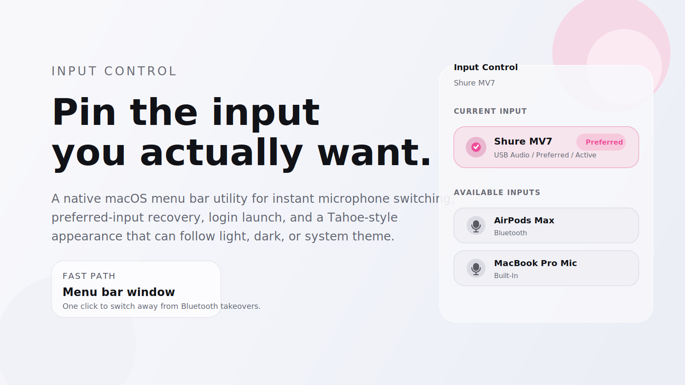
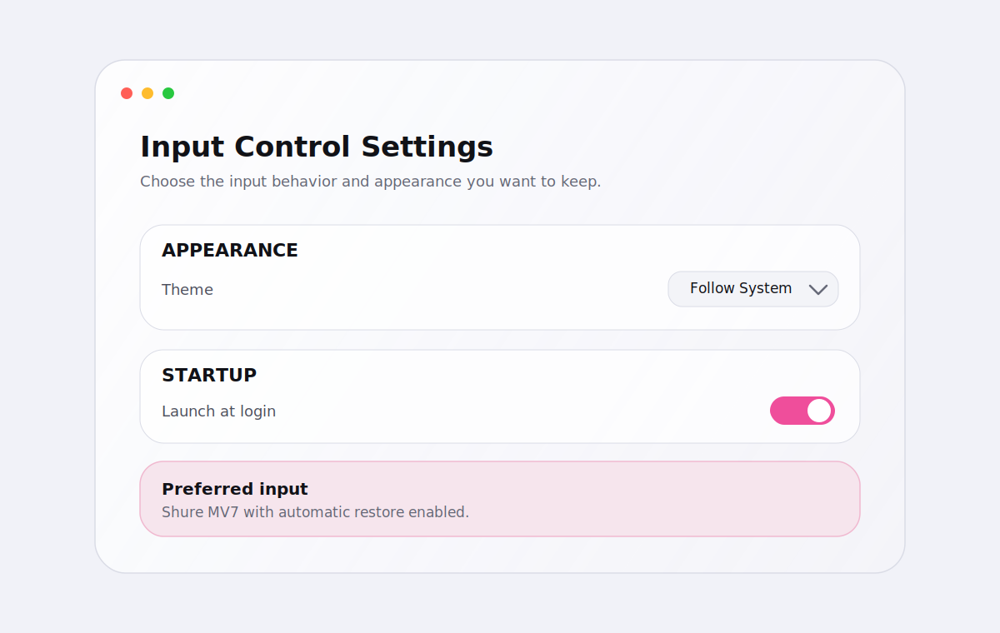

<p align="center">
  
</p>

<p align="center">
  <strong>Native macOS menu bar control for audio input switching.</strong><br />
  Built for the exact case where AirPods Max or other Bluetooth devices hijack your preferred microphone.
</p>

<p align="center">
  <a href="#download">Download</a>
  ·
  <a href="#what-it-does">Features</a>
  ·
  <a href="#build-from-source">Build</a>
  ·
  <a href="#release-artifacts">Release Artifacts</a>
</p>

## What It Does

Input Control lives in the macOS menu bar and gives you a fast, native way to:

- see the current audio input instantly
- switch between available input devices in one click
- set a preferred microphone
- automatically restore that preferred microphone if another device takes over
- configure launch at login from an in-app settings window

<p align="center">
  
</p>

## Why It Exists

Some Bluetooth devices, especially headphones with microphones, aggressively become the default input when they connect. This app keeps that behavior from derailing your actual setup.

If you want your USB mic, interface, or built-in mic to stay active, Input Control makes that state easy to see and easy to recover.

## Download

The intended public distribution path is the GitHub Releases page for this repository. Once the repo is published, the latest downloadable build should live under:

`Releases -> latest -> Input-Control-macOS-universal.zip`

## Build From Source

### Build the app

```bash
chmod +x scripts/build-app.sh
./scripts/build-app.sh --run
```

Output:

- `dist/Input Control.app`

### Install to `/Applications`

```bash
chmod +x scripts/install-app.sh
./scripts/install-app.sh
```

### Open in Xcode

```bash
chmod +x scripts/open-in-xcode.sh
./scripts/open-in-xcode.sh
```

### Build with Xcode from the terminal

```bash
chmod +x scripts/xcodebuild-macos.sh
./scripts/xcodebuild-macos.sh
```

## Release Artifacts

To generate the exact files intended for GitHub Releases:

```bash
chmod +x scripts/build-release.sh
./scripts/build-release.sh
```

Output:

- `release/Input-Control-macOS-universal.zip`
- `release/SHA256SUMS.txt`

## Recommended Setup

1. Install the app to `/Applications`.
2. Open it once manually.
3. In Settings, pick your preferred input.
4. Enable `Launch at login` if you want the app active on every boot.

## Project Layout

- `InputControl.xcodeproj` is the primary app target for shipping and signing.
- `Sources/` contains the native SwiftUI and AppKit implementation.
- `Resources/Assets.xcassets` contains the app icon asset catalog.
- `scripts/build-release.sh` creates release-ready archives for GitHub Releases.
